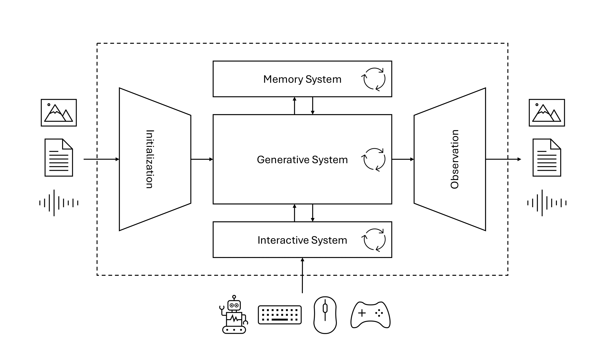
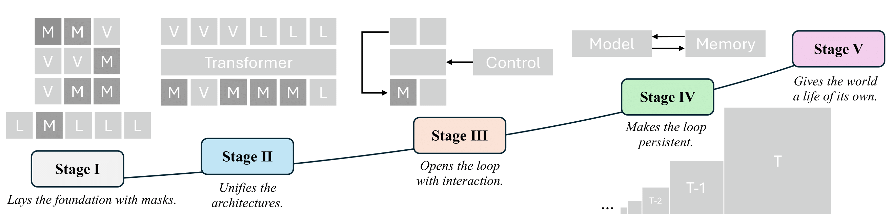

# Awesome World Models: A Hitchhiker's Guide [](https://awesome.re) [](https://arxiv.org/abs/2510.20668)

> A curated list of papers and resources on World Models, following the evolutionary roadmap from the position paper: **"From Masks to Worlds: A Hitchhiker's Guide to World Models"**.
>
> This repository catalogues the papers and concepts discussed in the position paper, which charts a clear path from foundational techniques to the frontier of building living, interactive worlds. The journey is structured into five key stages, preceded by a conceptual and historical overview.

## What is a True World Model?

According to the survey, a true world model is not a monolithic entity but a system synthesized from three core subsystems:

* **The Generative Heart ($\mathcal{G}$):** The foundation that produces world states. It models the world's dynamics, appearance, and task-relevant outcomes.
* **The Interactive Loop ($\mathcal{F}, \mathcal{C}$):** Closes the action-perception cycle, enabling the model to support real-time interaction and adaptation through state inference and policy control.
* **The Memory System ($\mathcal{M}$):** Sustains coherence over long horizons by allowing past events to inform the future via a persistent, recurrent state.




The integration of these components gives rise to the defining properties of a true world model: **Persistence**, **Agency**, and **Emergence**.

## The Evolutionary Roadmap



### Foundational Concepts & Historical Perspectives

* **World Models** (Ha & Schmidhuber, 2018)  
  [](https://arxiv.org/abs/1803.10122) [](https://worldmodels.github.io)
* **Dream to Control: Learning Behaviors by Latent Imagination** (Hafner et al., 2019)  
  [](https://arxiv.org/abs/1912.01603)
* **Mastering Atari, Go, Chess and Shogi by Planning with a Learned Model** (Schrittwieser et al., 2020)  
  [](https://arxiv.org/abs/1911.08265) [](https://deepmind.google/discover/blog/muzero-mastering-go-chess-shogi-and-atari-without-rules/)
* **Generative Agents: Interactive Simulacra of Human Behavior** (Park et al., 2023)  
  [](https://arxiv.org/abs/2304.03442) [](https://github.com/joonspk-research/generative_agents)
* **A Generalist Agent** (Reed et al., 2022)  
  [](https://arxiv.org/abs/2205.06175)
* **World Labs** (World Labs, 2024)  
  [](https://www.worldlabs.ai/)
* **Video Generation Models as World Simulators** (Brooks et al., 2024)  
  [](https://openai.com/research/video-generation-models-as-world-simulators)
* **Interactive Fiction** (Niesz & Holland, 1984)  
  [](https://www.journals.uchicago.edu/doi/abs/10.1086/448277?journalCode=ci)
* **Genie 1** (Bruce et al., 2024)  
  [](https://arxiv.org/abs/2402.15391) [](https://sites.google.com/view/genie-2024/home)
* **Genie 2** (Parker-Holder et al., 2024)  
  [](https://deepmind.google/discover/blog/genie-2-a-large-scale-foundation-world-model/)
* **Genie 3** (Ball et al., 2025)  
  [](https://deepmind.google/discover/blog/genie-3-a-new-frontier-for-world-models/)

### Stage I: Mask-based Models

#### Language Modality

* **BERT: Pre-training of Deep Bidirectional Transformers for Language Understanding** (Devlin et al., 2019)  
  [](https://arxiv.org/abs/1810.04805) [](https://github.com/google-research/bert)
* **SpanBERT: Improving Pre-training by Representing and Predicting Spans** (Joshi et al., 2020)  
  [](https://arxiv.org/abs/1907.10529) [](https://github.com/facebookresearch/SpanBERT)
* **MASS: Masked Sequence to Sequence Pre-training for Language Generation** (Song et al., 2019)  
  [](https://arxiv.org/abs/1905.02450) [](https://github.com/microsoft/MASS)
* **Exploring the Limits of Transfer Learning with a Unified Text-to-Text Transformer (T5)** (Raffel et al., 2020)  
  [](https://arxiv.org/abs/1910.10683) [](https://github.com/google-research/text-to-text-transfer-transformer)
* **BART: Denoising Sequence-to-Sequence Pre-training for Natural Language Generation, Translation, and Comprehension** (Lewis et al., 2019)  
  [](https://arxiv.org/abs/1910.13461)
* **ELECTRA: Pre-training Text Encoders as Discriminators Rather Than Generators** (Clark et al., 2020)  
  [](https://arxiv.org/abs/2003.10555) [](https://github.com/google-research/electra)
* **RoBERTa: A Robustly Optimized BERT Pretraining Approach** (Liu et al., 2019)  
  [](https://arxiv.org/abs/1907.11692) [](https://github.com/facebookresearch/fairseq/tree/main/examples/roberta)
* **Mask-Predict: Parallel Decoding of Conditional Masked Language Models** (Ghazvininejad et al., 2019)  
  [](https://arxiv.org/abs/1904.09324) [](https://github.com/facebookresearch/Mask-Predict)
* **Diffusion-LM Improves Controllable Text Generation** (Li et al., 2022)  
  [](https://arxiv.org/abs/2205.14217)
* **Diffusion-BERT: Improving Generative Masked Language Models with Diffusion Models** (He et al., 2022b)  
  [](https://arxiv.org/abs/2211.15029) [](https://github.com/Hzfinfdu/Diffusion-BERT)
* **DiffuSeq: Sequence to Sequence Text Generation with Diffusion Models** (Gong et al., 2022)  
  [](https://arxiv.org/abs/2210.08933) [](https://github.com/Shark-NLP/DiffuSeq)
* **Mercury: Ultra-fast Language Models based on Diffusion** (Inception Labs et al., 2025)  
  [](https://arxiv.org/abs/2506.17298) [](https://chat.inceptionlabs.ai/)
* **Gemini Diffusion** (DeepMind, 2025)  
  [](https://deepmind.google/models/gemini-diffusion/)
* **A Survey on Diffusion Language Models** (Li et al., 2025b)  
  [](https://arxiv.org/abs/2508.10875) [](https://github.com/VILA-Lab/Awesome-DLMs)
* **Discrete Diffusion in Large Language and Multimodal Models: A Survey** (Yu et al., 2025d)  
  [](https://arxiv.org/abs/2506.13759) [](https://github.com/LiQiiiii/DLLM-Survey)

#### Vision Modality

* **BEiT: BERT Pre-training of Image Transformers** (Bao et al., 2021)  
  [](https://arxiv.org/abs/2106.08254) [](https://github.com/microsoft/unilm/tree/master/beit)
* **Masked Autoencoders Are Scalable Vision Learners (MAE)** (He et al., 2022a)  
  [](https://arxiv.org/abs/2111.06377) [](https://github.com/facebookresearch/mae)
* **SimMIM: A Simple Framework for Masked Image Modeling** (Xie et al., 2022)  
  [](https://arxiv.org/abs/2111.09886) [](https://github.com/microsoft/SimMIM)
* **iBOT: Image BERT Pre-training with Online Tokenizer** (Zhou et al., 2021)  
  [](https://arxiv.org/abs/2111.07832) [](https://github.com/bytedance/ibot)
* **Masked Feature Prediction for Self-Supervised Visual Pre-Training** (Wei et al., 2022)  
  [](https://arxiv.org/abs/2112.09133) [](https://github.com/facebookresearch/pytorchvideo)
* **MaskGIT: Masked Generative Image Transformer** (Chang et al., 2022)  
  [](https://arxiv.org/abs/2202.04200) [](https://github.com/google-research/maskgit) [](https://masked-generative-image-transformer.github.io/)
* **MUSE: Text-To-Image Generation via Masked Generative Transformers** (Chang et al., 2023)  
  [](https://arxiv.org/abs/2301.00704) [](https://github.com/lucidrains/muse-maskgit-pytorch) [](https://muse-model.github.io/)
* **Meissonic: Revitalizing Masked Generative Transformers for Efficient High-Resolution Text-to-Image Synthesis** (Bai et al., 2024)  
  [](https://arxiv.org/abs/2410.08261) [](https://github.com/viiika/Meissonic) [](https://viiika.github.io/Meissonic/)
* **VideoMAE: Masked Autoencoders are Data-Efficient Learners for Self-Supervised Video Pre-Training** (Tong et al., 2022)  
  [](https://arxiv.org/abs/2203.12602) [](https://github.com/MCG-NJU/VideoMAE)

#### Other Modalities

* **wav2vec 2.0: A Framework for Self-Supervised Learning of Speech Representations** (Baevski et al., 2020)  
  [](https://arxiv.org/abs/2006.11477) [](https://github.com/facebookresearch/fairseq/tree/main/examples/wav2vec)
* **HuBERT: Self-Supervised Speech Representation Learning by Masked Prediction of Hidden Units** (Hsu et al., 2021)  
  [](https://arxiv.org/abs/2106.07447) [](https://github.com/facebookresearch/fairseq/tree/main/examples/hubert)
* **WavLM: Large-Scale Self-Supervised Pre-Training for Full Stack Speech Processing** (Chen et al., 2022)  
  [](https://arxiv.org/abs/2110.13900) [](https://github.com/microsoft/unilm/tree/master/wavlm)
* **Masked Autoencoders That Listen (Audio-MAE)** (Huang et al., 2022)  
  [](https://arxiv.org/abs/2207.06405) [](https://github.com/facebookresearch/AudioMAE)
* **Point-BERT: Pre-training 3D Point Cloud Transformers with Masked Point Modeling** (Yu et al., 2022)  
  [](https://arxiv.org/abs/2111.14819) [](https://github.com/lulutang0608/Point-BERT) [](https://point-bert.ivg-research.xyz/)
* **Masked Autoencoders for 3D Point Cloud Self-Supervised Learning (Point-MAE)** (Pang et al., 2023)  
  [](https://arxiv.org/abs/2203.01529) [](https://github.com/Pang-Yatian/Point-MAE)
* **GraphMAE: Self-Supervised Masked Graph Autoencoders** (Hou et al., 2022)  
  [](https://arxiv.org/abs/2205.10803) [](https://github.com/THUDM/GraphMAE)

### Stage II: Unified Models

#### Extending Language Model Pre-training (Language-Prior)

* **Language Models are Unsupervised Multitask Learners (GPT-2)** (Radford et al., 2019)  
  [](https://cdn.openai.com/better-language-models/language_models_are_unsupervised_multitask_learners.pdf) [](https://github.com/openai/gpt-2) [](https://openai.com/research/better-language-models)
* **Language Models are Few-Shot Learners (GPT-3)** (Brown et al., 2020)  
  [](https://arxiv.org/abs/2005.14165) [](https://github.com/openai/gpt-3)
* **Autoregressive model beats diffusion: Llama for scalable image generation** (Sun et al., 2024)  
  [](https://arxiv.org/abs//2406.06525) [](https://github.com/FoundationVision/LlamaGen) [](https://peizesun.github.io/llamagen/)

* **BLIP-2: Bootstrapping Language-Image Pre-training with Frozen Image Encoders and Large Language Models** (Li et al., 2023)  
  [](https://arxiv.org/abs/2301.12597) [](https://github.com/salesforce/LAVIS/tree/main/projects/blip2) [](https://www.salesforce.com/blog/blip-2/)
* **Visual Instruction Tuning (LLaVA)** (Liu et al., 2023b)  
  [](https://arxiv.org/abs/2304.08485) [](https://github.com/haotian-liu/LLaVA) [](https://llava-vl.github.io/)
* **Improved Baselines with Visual Instruction Tuning (LLaVA-1.5)** (Liu et al., 2024)  
  [](https://arxiv.org/abs/2310.03744) [](https://github.com/haotian-liu/LLaVA) [](https://llava-vl.github.io/)
* **LLaMA: Open and Efficient Foundation Language Models** (Touvron et al., 2023)  
  [](https://arxiv.org/abs/2302.13971) [](https://github.com/meta-llama/Llama)
* **Kosmos-2: Grounding Multimodal Large Language Models to the World** (Peng et al., 2023)  
  [](https://arxiv.org/abs/2306.14824) [](https://github.com/microsoft/unilm/tree/master/kosmos-2)
* **PaLM-E: An Embodied Multimodal Language Model** (Driess et al., 2023)  
  [](https://arxiv.org/abs/2303.03378) [](https://palm-e.github.io/)
* **Generative Multimodal Models are In-Context Learners (EMU2)** (Sun et al., 2024)  
  [](https://arxiv.org/abs/2312.13286) [](https://github.com/baaivision/Emu) [](https://baaivision.github.io/emu2/)
* **Emu3: Next-Token Prediction is All You Need** (Wang et al., 2024)  
  [](https://arxiv.org/abs/2409.18869) [](https://github.com/baaivision/Emu3) [](https://emu.baai.ac.cn/about)
* **Chameleon: Mixed-Modal Early-Fusion Foundation Models** (Chameleon Team, 2024)  
  [](https://arxiv.org/abs/2405.09818) [](https://github.com/facebookresearch/chameleon) [](https://ai.meta.com/blog/meta-fair-research-new-releases/)
* **VILA-U: a unified foundation model integrating visual understanding and generation** (Wu et al., 2024)  
  [](https://arxiv.org/abs/2409.04429) [](https://github.com/mit-han-lab/vila-u) [](https://hanlab.mit.edu/projects/vila-u)
* **Janus-Pro: Unified Multimodal Understanding and Generation with Data and Model Scaling** (Chen et al., 2025)  
  [](https://arxiv.org/abs/2501.17811) [](https://github.com/deepseek-ai/Janus)
* **Large Language Diffusion Models (LLaDA)** (Nie et al., 2025)  
  [](https://arxiv.org/abs/2502.09992) [](https://github.com/ML-GSAI/LLaDA) [](https://ml-gsai.github.io/LLaDA-demo)
* **MMaDA: Multimodal Large Diffusion Language Models** (Yang et al., 2025)  
  [](https://arxiv.org/abs/2505.15809) [](https://github.com/Gen-Verse/MMaDA)
* **Lavida-O: Elastic Masked Diffusion Models for Unified Multimodal Understanding and Generation** (Li et al., 2025)  
  [](https://arxiv.org/abs/2509.19244) [](https://github.com/jacklishufan/LaViDa) [](https://github.com/adobe-research/LaVida-O) 
* **OneFlow: Concurrent Mixed-Modal and Interleaved Generation with Edit Flows** (Nguyen et al., 2025)  
  [](https://arxiv.org/abs/2510.03506) [](https://oneflow.framer.ai/)
* **Lumina-DiMOO: An Omni Diffusion Large Language Model for Multi-Modal Generation and Understanding** (Xin et al., 2025)  
  [](https://arxiv.org/abs/2510.06308) [](https://github.com/Alpha-VLLM/Lumina-DiMOO) [](https://synbol.github.io/Lumina-DiMOO/)
* **Diffuse Everything: Multimodal Diffusion Models on Arbitrary State Spaces** (Rojas et al., 2025)  
  [](https://arxiv.org/abs/2506.07903) [](https://github.com/KevinRojas1499/Diffuse-Everything) [](https://x.com/YuchenZhu_ZYC/status/1934700344707363180)
#### Extending Vision Model Pre-training (Visual-Prior)

* **High-Resolution Image Synthesis with Latent Diffusion Models (Stable Diffusion)** (Rombach et al., 2022)  
  [](https://arxiv.org/abs/2112.10752) [](https://github.com/CompVis/stable-diffusion) [](https://ommer-lab.com/research/latent-diffusion-models/)
* **Meissonic: Revitalizing Masked Generative Transformers for Efficient High-Resolution Text-to-Image Synthesis** (Bai et al., 2024)  
  [](https://arxiv.org/abs/2410.08261) [](https://github.com/viiika/Meissonic) [](https://viiika.github.io/Meissonic/)
* **One Transformer Fits All Distributions in Multi-modal Diffusion at Scale (UniDiffuser)** (Bao et al., 2023)  
  [](https://arxiv.org/abs/2303.06555) [](https://github.com/thu-ml/unidiffuser)
* **Muddit: Liberating Generation Beyond Text-to-Image with a Unified Discrete Diffusion Model** (Shi et al., 2025)  
  [](https://arxiv.org/abs/2505.23606) [](https://github.com/M-E-AGI-Lab/Muddit) [](https://muddit.github.io/)
* **Unified Multimodal Discrete Diffusion (UniDisc)** (Swerdlow et al., 2025)  
  [](https://arxiv.org/abs/2503.20853) [](https://github.com/alexanderswerdlow/unidisc) [](https://unidisc.github.io/)

#### Industrial-Scale Unified Systems

* **Gemini 2.5: Pushing the frontier with advanced reasoning, multimodality, long context, and next generation agentic capabilities** (Comanici et al., 2025)  
  [](https://arxiv.org/abs/2507.06261) [](https://deepmind.google/models/gemini/)
* **GPT-4o** (Hurst et al., 2024)  
  [](https://arxiv.org/abs/2410.21276) [](https://openai.com/index/hello-gpt-4o/)

### Stage III: Interactive Generative Models

#### Language-based Worlds

* **Interactive Fiction** (Niesz & Holland, 1984)  
  [](https://www.journals.uchicago.edu/doi/abs/10.1086/448277?journalCode=ci)
* **Toward a Theory of Interactive Fiction** (Montfort, 2011)  
  [](https://www.inform-fiction.org/manual/if_theory_reader.pdf#page=31) [](https://nickm.com/if/toward.html)
* **Bringing Stories Alive: Generating Interactive Fiction Worlds** (Ammanabrolu et al., 2020)  
  [](https://arxiv.org/abs/2001.10161) [](https://github.com/rajammanabrolu/WorldGeneration)
* **Memories Off: Sorekara** (KID, 2004)  
  [](https://en.wikipedia.org/wiki/Memories_Off:_Sorekara)
* **TextWorld: A Learning Environment for Text-Based Games** (Côté et al., 2018)  
  [](https://arxiv.org/abs/1806.11532) [](https://github.com/microsoft/textworld) [](https://www.microsoft.com/en-us/research/project/textworld/)
* **Interactive Fiction Games: A Colossal Adventure (Jericho)** (Hausknecht et al., 2020)  
  [](https://arxiv.org/abs/1909.05398) [](https://github.com/microsoft/jericho)
* **AI Dungeon** (Latitude, 2024)  
  [](https://play.aidungeon.com/)

#### Video-based and Scene-based Worlds

* **Learning to Simulate Dynamic Environments with GameGAN** (Kim et al., 2020)  
  [](https://arxiv.org/abs/2005.12126) [](https://github.com/nv-tlabs/gameGAN) [](https://research.nvidia.com/labs/toronto-ai/gameGAN/)
* **Playable Video Generation (PVG)** (Menapace et al., 2021)  
  [](https://arxiv.org/abs/2101.12195) [](https://github.com/willi-menapace/PlayableVideoGeneration) [](https://willi-menapace.github.io/playable-video-generation-website/)
* **Playable Environments: Video Manipulation in Space and Time (PE)** (Menapace et al., 2022)  
  [](https://arxiv.org/abs/2203.01914) [](https://github.com/willi-menapace/PlayableEnvironments) [](https://willi-menapace.github.io/playable-environments-website/)
* **Promptable Game Models: Text-Guided Game Simulation via Masked Diffusion Models (PGM)** (Menapace et al., 2024)  
  [](https://arxiv.org/abs/2303.13472) [](https://github.com/snap-research/promptable-game-models/) [](https://snap-research.github.io/promptable-game-models/)
* **Genie: A Generative Interactive Environment** (Bruce et al., 2024)  
  [](https://arxiv.org/abs/2402.15391) [](https://sites.google.com/view/genie-2024/)
* **Oasis: A Universe in a Transformer** (Decart et al., 2024)  
  [](https://oasis-model.github.io/) [](https://github.com/etched-ai/open-oasis)
* **Diffusion Models are Real-Time Game Engines (GameNGen)** (Valevski et al., 2024)  
  [](https://arxiv.org/abs/2408.14837) [](https://gamengen.github.io/)
* **MineWorld: a Real-Time and Open-Source Interactive World Model on Minecraft** (Guo et al., 2025)  
  [](https://arxiv.org/abs/2504.08388) [](https://github.com/microsoft/mineworld)
* **Matrix-Game 2.0: An Open-Source, Real-Time, and Streaming Interactive World Model** (He et al., 2025)  
  [](https://arxiv.org/abs/2508.13009) [](https://github.com/SkyworkAI/Matrix-Game/tree/main/Matrix-Game-2) [](https://matrix-game-v2.github.io/)
* **A Survey of Interactive Generative Video** (Yu et al., 2025)  
  [](https://arxiv.org/abs/2504.21853)

### Stage IV: Memory and Consistency

#### Externalized Memory (Retrieval-Augmented)

* **Neural Turing Machines** (Graves et al., 2014)  
  [](https://arxiv.org/abs/1410.5401)
* **Hybrid Computing using a Neural Network with Dynamic External Memory (DNC)** (Graves et al., 2016)  
  [](https://www.nature.com/articles/nature20101)
* **End-to-End Memory Networks (MemN2N)** (Sukhbaatar et al., 2015)  
  [](https://arxiv.org/abs/1503.08895) [](https://github.com/harvardnlp/MemN2N)
* **Generalization Through Memorization: Nearest Neighbor Language Models (kNN-LM)** (Khandelwal et al., 2019)  
  [](https://arxiv.org/abs/1911.00172) [](https://github.com/urvashik/knnlm)
* **Retrieval-Augmented Language Model Pre-training (REALM)** (Guu et al., 2020)  
  [](https://arxiv.org/abs/2002.08909)
* **Retrieval-Augmented Generation for Knowledge-Intensive NLP Tasks (RAG)** (Lewis et al., 2020)  
  [](https://arxiv.org/abs/2005.11401)
* **Dense Passage Retrieval for Open-Domain Question Answering (DPR)** (Karpukhin et al., 2020)  
  [](https://arxiv.org/abs/2004.04906) [](https://github.com/facebookresearch/DPR)
* **Improving Language Models by Retrieving from Trillions of Tokens (RETRO)** (Borgeaud et al., 2022)  
  [](https://arxiv.org/abs/2112.04426) [](https://github.com/lucidrains/RETRO-pytorch)
* **Large Memory Layers with Product Keys (PKM)** (Lample et al., 2019)  
  [](https://arxiv.org/abs/1907.05242) [](https://github.com/facebookresearch/XLM)
* **MemGPT: Towards LLMs as Operating Systems** (Packer et al., 2023)  
  [](https://arxiv.org/abs/2310.08560) [](https://github.com/letta-ai/letta) [](https://www.letta.com/)
* **Augmenting Language Models with Long-term Memory (LONGMEM)** (Wang et al., 2023b)  
  [](https://arxiv.org/abs/2306.07174) [](https://github.com/Victorwz/LongMem)
* **From RAG to Memory: Non-Parametric Continual Learning for Large Language Models** (Gutiérrez et al., 2025)  
  [](https://arxiv.org/abs/2502.14802) [](https://github.com/OSU-NLP-Group/HippoRAG)

#### Architectural Memory (Long-Context)

* **Universal Transformers** (Dehghani et al., 2018)  
  [](https://arxiv.org/abs/1807.03819)
* **Transformer-XL: Attentive Language Models Beyond a Fixed-Length Context** (Dai et al., 2019)  
  [](https://arxiv.org/abs/1901.02860) [](https://github.com/kimiyoung/transformer-xl)
* **Compressive Transformers for Long-Range Sequence Modelling** (Rae et al., 2019)  
  [](https://arxiv.org/abs/1911.05507) [](https://github.com/lucidrains/compressive-transformer-pytorch)
* **Memorizing Transformers** (Wu et al., 2022)  
  [](https://arxiv.org/abs/2203.08913) [](https://github.com/lucidrains/memorizing-transformers-pytorch)
* **Recurrent Memory Transformer (RMT)** (Bulatov et al., 2022)  
  [](https://arxiv.org/abs/2207.06881) [](https://github.com/booydar/LM-RMT)
* **Leave No Context Behind: Efficient Infinite Context Transformers with Infini-attention** (Munkhdalai et al., 2024)  
  [](https://arxiv.org/abs/2404.07143)
* **General-Purpose, Long-Context Autoregressive Modeling with Perceiver AR** (Hawthorne et al., 2022)  
  [](https://arxiv.org/abs/2202.07765) [](https://github.com/google-research/perceiver-ar) [](https://magenta.withgoogle.com/perceiver-ar)
* **Structured State Space Models for In-Context Reinforcement Learning (S4)** (Lu et al., 2023)  
  [](https://arxiv.org/abs/2303.03982) [](https://github.com/luchris429/popjaxrl)
* **Mamba: Linear-Time Sequence Modeling with Selective State Spaces** (Gu & Dao, 2023)  
  [](https://arxiv.org/abs/2312.00752) [](https://github.com/state-spaces/mamba)
* **Retentive Network: A Successor to Transformer for Large Language Models (RetNet)** (Sun et al., 2023)  
  [](https://arxiv.org/abs/2307.08621) [](https://github.com/microsoft/unilm/tree/master/retnet)
* **Transformers are RNNs: Fast Autoregressive Transformers with Linear Attention** (Katharopoulos et al., 2020)  
  [](https://arxiv.org/abs/2006.16236) [](https://github.com/idiap/fast-transformers) [](https://linear-transformers.com/)
* **Hyena Hierarchy: Towards Larger Convolutional Language Models** (Poli et al., 2023)  
  [](https://arxiv.org/abs/2302.10866) [](https://github.com/HazyResearch/safari)
* **LongNet: Scaling Transformers to 1,000,000,000 Tokens** (Ding et al., 2023)  
  [](https://arxiv.org/abs/2307.02486) [](https://github.com/kyegomez/LongNet)
* **Ring Attention with Blockwise Transformers for Near-Infinite Context** (Liu et al., 2023a)  
  [](https://arxiv.org/abs/2310.01889) [](https://github.com/haoliuhl/ringattention)
* **Long-Context State-Space Video World Models (LSSVWM)** (Po et al., 2025)  
  [](https://arxiv.org/abs/2505.20171) [](https://ryanpo.com/ssm_wm/)
* **Train Short, Test Long: Attention with Linear Biases Enables Input Length Extrapolation (ALiBi)** (Press et al., 2021)  
  [](https://arxiv.org/abs/2108.12409) [](https://github.com/jaketae/alibi)
* **LongLoRA: Efficient Fine-Tuning of Long-Context Large Language Models** (Chen et al., 2023)  
  [](https://arxiv.org/abs/2309.12307) [](https://github.com/dvlab-research/LongLoRA)
* **In-Context KV-Cache Eviction for LLMs via Attention-Gate (StreamingLLM)** (Zeng et al., 2024)  
  [](https://arxiv.org/abs/2410.12876)

#### Regulating Memory for Consistency

* **Packing Input Frame Context in Next-Frame Prediction Models for Video Generation (FramePack)** (Zhang & Agrawala, 2025)  
  [](https://arxiv.org/abs/2504.12626) [](https://github.com/lllyasviel/FramePack) [](https://lllyasviel.github.io/frame_pack_gitpage/)
* **Self Forcing: Bridging the Train-Test Gap in Autoregressive Video Diffusion** (Huang et al., 2025)  
  [](https://arxiv.org/abs/2506.08009) [](https://github.com/guandeh17/Self-Forcing) [](https://self-forcing.github.io/)
* **From Slow Bidirectional to Fast Autoregressive Video Diffusion Models (CausVid)** (Yin et al., 2025)  
  [](https://arxiv.org/abs/2412.07772) [](https://github.com/tianweiy/CausVid) [](https://causvid.github.io/)
* **Context as Memory: Scene-Consistent Interactive Long Video Generation with Memory Retrieval** (Yu et al., 2025a)  
  [](https://arxiv.org/abs/2506.03141) [](https://context-as-memory.github.io/)
* **Mixture of Contexts for Long Video Generation (MoC)** (Cai et al., 2025)  
  [](https://arxiv.org/abs/2508.21058) [](https://primecai.github.io/moc/)
* **Structured 3D Latents for Scalable and Versatile 3D Generation (Trellis)** (Xiang et al., 2025)  
  [](https://arxiv.org/abs/2412.01506) [](https://github.com/Microsoft/TRELLIS) [](https://microsoft.github.io/TRELLIS/)
* **TripoSG: High-Fidelity 3D Shape Synthesis using Large-Scale Rectified Flow Models** (Li et al., 2025c)  
  [](https://arxiv.org/abs/2502.06608) [](https://github.com/VAST-AI-Research/TripoSG) [](https://yg256li.github.io/TripoSG-Page/)
* **WorldMem: Long-Term Consistent World Simulation with Memory** (Xiao et al., 2025)  
  [](https://arxiv.org/abs/2504.12369) [](https://github.com/xizaoqu/WorldMem) [](https://xizaoqu.github.io/worldmem/)
* **Video World Models with Long-Term Spatial Memory** (Wu et al., 2025)  
  [](https://arxiv.org/abs/2506.05284) [](https://spmem.github.io/)
* **VMem: Consistent Interactive Video Scene Generation with Surfel-Indexed View Memory** (Li et al., 2025a)  
  [](https://arxiv.org/abs/2506.18903) [](https://github.com/runjiali-rl/vmem) [](https://v-mem.github.io/)
* **Self-RAG: Learning to Retrieve, Generate, and Critique Through Self-Reflection** (Asai et al., 2024)  
  [](https://arxiv.org/abs/2310.11511) [](https://github.com/AkariAsai/self-rag) [](https://selfrag.github.io/)
* **Claude 3.5 Sonnet** (Anthropic, 2024)  
  [](https://www.anthropic.com/news/claude-3-5-sonnet)

### Stage V: Towards True World Models

This stage is defined by the emergence of three key properties:

* **Persistence**: The world's state and history exist and accumulate consequence independently of any single user session.
* **Agency**: The world is inhabited by multiple, goal-directed agents (human or AI) interacting in a shared context.
* **Emergence**: Macro-level dynamics arise from micro-level interactions rather than being explicitly scripted.

### Frontier Challenges

The path to achieving Stage V is defined by three fundamental, unsolved research problems:

1.  **The Coherence Problem (Evaluation)**: How to formalize and measure the internal logical, causal, and narrative coherence of a self-generating reality that writes its own history.
2.  **The Compression Problem (Scaling)**: How to learn causally sufficient state abstractions to preserve consequence while discarding noise, avoiding computational collapse from an ever-growing history.
3.  **The Alignment Problem (Safety)**: How to align not only the world's underlying laws but also the emergent, unpredictable dynamics of the multi-agent society interacting within it.
   


## 📚 Citation

If you find this work helpful, please consider citing:

```bibtex
@article{shi2025muddit,
  title={From Masks to Worlds: A Hitchhiker's Guide to World Models},
  author={Bai, Jinbin and Lei, Yu and Wu, Hecong and Zhu, Yuchen and Li, Shufan and Xin, Yi and Li, Xiangtai and Tao, Molei and Grover, Aditya and Yang, Ming-Hsuan},
  journal={arXiv preprint arXiv:2510.20668},
  year={2025}
}
```

---

<p align="center">
  <a href="https://star-history.com/#M-E-AGI-Lab/Awesome-World-Models&Date">
    
  </a>
</p>

